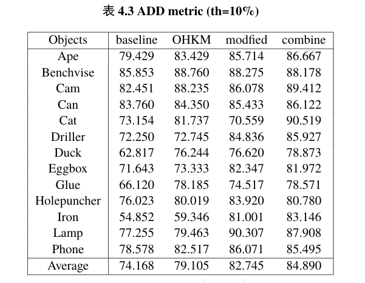
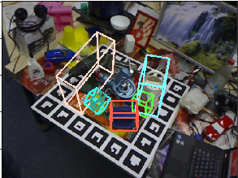

# Real-time Multi-object Pose estimation
+ This is my undergraduate project in 2019 to implement real-time mutli-object pose estimation in real-time with RGB images as input
+ The project inspired by Microsofy Research Project:https://github.com/microsoft/singleshotpose and YOLOv3
+ Original trained network weight has lost due to my moving and graduation
+ The repo will be updated and with new network weight at next version
+ Chosen results in my undergraduate thesis
  + Single Object\
    
  + Multi Object\
    
    (left:groundtruth,right:prediction)
+ Data
  + Pre-processed LineMod used in [Project](https://sites.google.com/view/densefusion)
  + intrinsic matrix
    + fx=572.41140, px=325.26110, fy=573.57043; py=242.04899
  + format
    + general config
      + ```diam``` or ```diameters```
      + ```trainlist``` and ```testlist```
      + ```mask_path```, ```depth_mask``` and ```img_path```
    + item specific
      + ```img_name```
      + ```gt```
        + list of dicts
        + each item contains:
          + ```cam_R_m2c``` rotation matrix in 9x1
          + ```cam_t_m2c``` 3x1 tranlation vector
          + ```kps``` 18x1 x,y keypoints
            + orders centroid,(xmin,ymin,zmin),(xmin,ymin,zmax),...,(xmax,ymax,zmax)
          + ```obj_bb``` bbox of object 
            + xmin,ymin,w,h
          + ```obj_id```
+ next steps
  + [ ] dataloader
    + why not augment using general tricks that rotation and tranlation since we just need to train network to predict keypoints 
  + [ ] network
  + [ ] inference
  + [ ] evaluation
    + 3d IoU
  + [ ] Working on other projects, continue after Apr 15.
+ Code Structure
  + Data
      + dataset annotation in json
      + dataset convert
    + Models
      + utils - necessary function
        + maybe move evaluation metric here?
      + network
      + loss
      + backbone network
      + network configuration
    + dataProcessing
      + dataloader for train and test
    + Utils
      + logger
      + evaluation/metric
      + non-maximum-supression
    + visualization - jupyter notebook
    + Trainer - APIs
      + save/load weights
      + lr scheduler
      + optimizer(sometimes need to pass in network for things like GAN)    
    + train
    + test
    + evaluation - evaluate predicted result
    + config - configurate parpameters